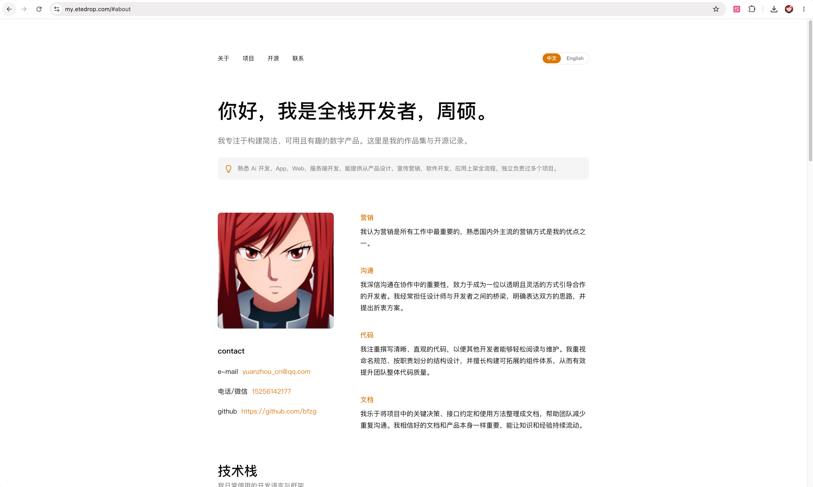
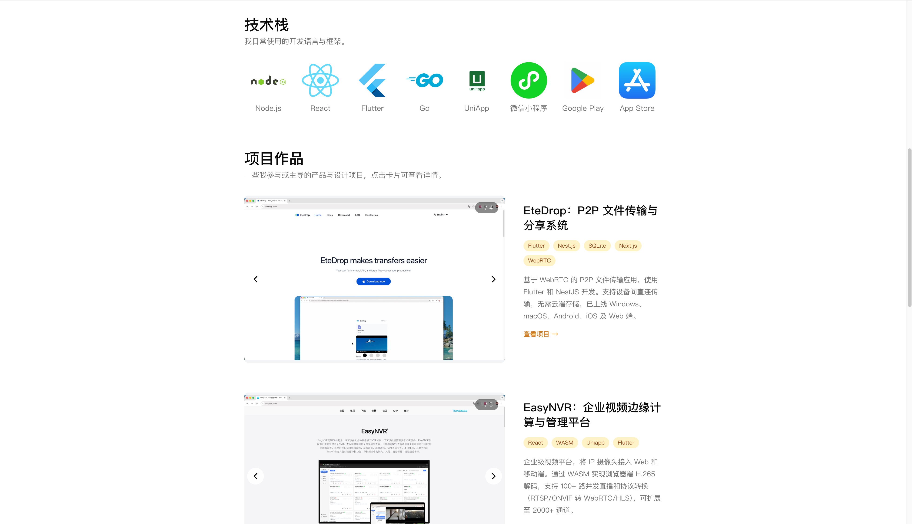
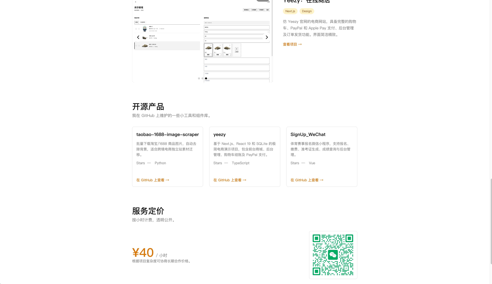

# EteDrop Portfolio

> A clean, bilingual, responsive personal portfolio built with Next.js 14.

[简体中文](#简体中文) | [English](#english)

---

## 简体中文

### 简介

这是一个基于 **Next.js 14 + React + TypeScript + Tailwind CSS** 构建的开发者个人作品集网站。设计风格简洁、轻量、内容优先，支持中英文双语切换，内置管理后台，方便随时更新内容。

### 在线预览

🔗 **https://my.etedrop.com/#about**

### 截图

| 关于我 | 技术栈与项目 | 开源产品与定价 |
|--------|--------------|----------------|
|  |  |  |

### 功能特性

- **响应式布局**：同时适配桌面端与移动端
- **双语支持**：内置中文 / 英文语言切换
- **管理后台**：可视化编辑首页 Hero、关于我、技术栈、项目作品、开源产品、服务定价与联系方式
- **图片上传**：技术栈图标、项目截图、微信二维码等均可通过管理后台上传
- **应用商店徽章**：项目卡片支持 App Store / Google Play 徽章展示
- **服务定价**：支持按小时展示服务报价（人民币 / 美元）
- **开源产品**：以卡片形式展示 GitHub 仓库，并支持动态增删

### 技术栈

- [Next.js 14](https://nextjs.org/)
- [React 18](https://react.dev/)
- [TypeScript](https://www.typescriptlang.org/)
- [Tailwind CSS](https://tailwindcss.com/)
- JSON 文件作为轻量 CMS 数据源

### 本地运行

```bash
# 克隆仓库
git clone https://github.com/<your-username>/<your-repo>.git
cd <your-repo>

# 安装依赖
npm install

# 启动开发服务器
npm run dev
```

默认在 http://localhost:3000 打开。

### 内容管理

项目使用本地 JSON 文件（`src/data/portfolio.zh.json` 与 `src/data/portfolio.en.json`）存储内容，无需数据库。

同时提供一个轻量管理后台，访问路径：

```
http://localhost:3000/admin
```

在管理后台中，你可以：
- 编辑 Hero 区域标题与副标题
- 更新关于我、联系方式与头像
- 上传并管理技术栈图标
- 添加 / 删除 / 编辑项目作品
- 添加 / 删除 / 编辑开源产品
- 更新服务定价与说明

> 注意：由于内容直接写入项目文件，生产环境如需启用管理后台，请确保运行环境具有文件写入权限，并做好访问控制。

### 构建与部署

```bash
npm run build
npm start
```

支持任何支持 Node.js 的静态托管或 Serverless 平台，如 Vercel、Netlify、Cloudflare Pages 等。

### 许可证

[MIT](./LICENSE)

### 联系方式

- Email：yuanzhou_cn@qq.com
- 电话 / 微信：15256142177
- GitHub：https://github.com/bfzx

---

## English

### Introduction

A clean, lightweight, content-first personal portfolio website built with **Next.js 14 + React + TypeScript + Tailwind CSS**. It supports Chinese/English bilingual switching and includes a lightweight admin panel for easy content updates.

### Live Demo

🔗 **https://my.etedrop.com/#about**

### Screenshots

| About Me | Tech Stack & Projects | Open Source & Pricing |
|----------|-----------------------|------------------------|
|  |  |  |

### Features

- **Responsive layout** for both desktop and mobile devices
- **Bilingual support** with built-in Chinese / English switching
- **Admin dashboard** for editing Hero, About, Tech Stack, Projects, Open Source, Pricing, and Contact sections
- **Image uploads** for tech stack icons, project screenshots, WeChat QR codes, and more
- **App Store badges** on project cards for App Store / Google Play links
- **Service pricing** displayed hourly in CNY / USD
- **Open source showcase** with GitHub repo cards and dynamic add/remove support

### Tech Stack

- [Next.js 14](https://nextjs.org/)
- [React 18](https://react.dev/)
- [TypeScript](https://www.typescriptlang.org/)
- [Tailwind CSS](https://tailwindcss.com/)
- JSON files as a lightweight CMS data source

### Run Locally

```bash
# Clone the repository
git clone https://github.com/<your-username>/<your-repo>.git
cd <your-repo>

# Install dependencies
npm install

# Start the development server
npm run dev
```

Open http://localhost:3000 in your browser.

### Content Management

Content is stored in local JSON files (`src/data/portfolio.zh.json` and `src/data/portfolio.en.json`), so no database is required.

A lightweight admin dashboard is also available at:

```
http://localhost:3000/admin
```

From the admin panel, you can:
- Edit the Hero title and subtitle
- Update the About section, contact info, and avatar
- Upload and manage tech stack icons
- Add / remove / edit projects
- Add / remove / edit open source repos
- Update service pricing and notes

> Note: Since content is written directly into project files, make sure the production environment has file write permissions and proper access control if you enable the admin dashboard.

### Build & Deploy

```bash
npm run build
npm start
```

Works with any Node.js-compatible static or serverless hosting platform, such as Vercel, Netlify, or Cloudflare Pages.

### License

[MIT](./LICENSE)

### Contact

- Email: yuanzhou_cn@qq.com
- Phone / WeChat: 15256142177
- GitHub: https://github.com/bfzx

---

## GitHub 仓库描述 / Repository Description

**中文：**

> 一个基于 Next.js 14 + TypeScript + Tailwind CSS 的开发者个人作品集模板，支持中英文双语、响应式布局、管理后台、图片上传、服务定价与应用商店徽章展示。

**English:**

> A developer portfolio template built with Next.js 14 + TypeScript + Tailwind CSS. Supports Chinese/English bilingual content, responsive layout, admin dashboard, image uploads, service pricing, and App Store / Google Play badges.
